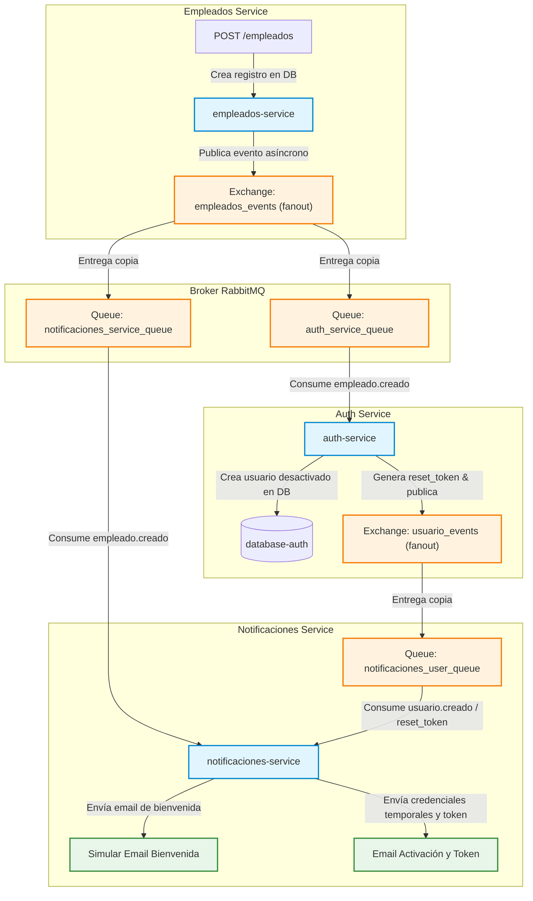

# 📊 Análisis de Ingeniería y Arquitectura: Proyecto Final CheckIn Microservicios

Este documento presenta una evaluación detallada y exhaustiva del proyecto **CheckIn Microservicios**, un ecosistema modular de grado empresarial diseñado para la gestión integral de empleados. La arquitectura destaca por su naturaleza políglota, su diseño de seguridad distribuido pero centralizado en identidad, su integración de mensajería asíncrona, y una pila de observabilidad moderna en 360 grados combinada con pipelines automatizados de Integración Continua (CI).

---

## 🗺️ 1. Arquitectura y Topología de Microservicios

El sistema adopta un diseño descentralizado donde cada dominio de negocio está delimitado en un microservicio autónomo (**Database-per-Service**). Esta independencia tecnológica permite que cada componente se desarrolle en el lenguaje y framework óptimo para sus requisitos.

### 🏢 Desglose de Componentes Tecnológicos

| Servicio | Puerto Externo | Tecnología Principal | Base de Datos (PostgreSQL) | Rol en el Ecosistema |
| :--- | :--- | :--- | :--- | :--- |
| **`api-gateway`** | `8088` | Python / Flask | N/A | Punto único de entrada (Proxy), enrutamiento, composición de datos y validación de tokens perimetral. |
| **`auth-service`** | `8082` | Python / Flask | `database-auth` (`5432`) | Proveedor de Identidad central (IdP). Genera JWT, hashea credenciales y gestiona recuperación de cuentas. |
| **`empleados-service`** | `8080` | Python / Flask | `database-empleados` (`5437`) | Administración del ciclo de vida de los empleados (CRUD) y publicación de eventos de dominio. |
| **`departamentos-service`** | `8086` | Python / Flask | `database-departamentos` (`5438`) | Gestión de la estructura organizacional y departamentos. Incluye simulador de caos/latencia. |
| **`perfiles-service`** | `8083` | Java / Spring Boot | `database-perfiles` (`5439`) | Gestión detallada del perfil laboral y habilidades del empleado. |
| **`vacaciones-service`** | `8085` | Node.js / Express | `database-vacaciones` (`5441`) | Solicitudes, historial y aprobaciones de vacaciones. |
| **`notificaciones-service`**| `8084` | C# / .NET Core | `database-notificaciones` (`5440`) | Consumidor de eventos y envío/simulación de emails SMTP. |

### 🌉 El API Gateway como Orquestador Perimetral
El servicio `api-gateway` actúa como un proxy inverso de la API. Cumple las siguientes funciones clave:
1. **Abstracción del Cliente:** El frontend solo se comunica con el puerto `8088`, sin conocer la topología de puertos de la red interna de Docker (`checkin-net`).
2. **Validación JWT Centralizada:** Protege el backend deteniendo peticiones malformadas o expiradas en la frontera antes de que consuman recursos de los microservicios de aplicación.
3. **Composición de Respuestas (Aggregation Pattern):** El endpoint `/empleados/<id>` realiza llamadas paralelas y asíncronas a `empleados-service` (datos básicos) y `perfiles-service` (perfil avanzado), fusionando el payload en un solo JSON estructurado para el cliente.

---

## 🔐 2. Modelo de Seguridad: JWT & RBAC (Role-Based Access Control)

La seguridad del sistema está diseñada para evitar puntos únicos de fallo funcionales mientras se mantiene un control centralizado de los datos de identidad.

### 🔑 Estructura y Firma del Token JWT
El sistema utiliza tokens basados en el estándar **JWT (RFC 7519)** firmados simétricamente con el algoritmo **HS256 (HMAC SHA-256)** mediante una firma secreta compartida (`JWT_SECRET`). 

```
┌────────────────────────────────────────────────────────┐
│ Header:   {"alg": "HS256", "typ": "JWT"}               │
├────────────────────────────────────────────────────────┤
│ Payload:  {                                            │
│             "sub": "username_del_usuario",             │
│             "role": "ADMIN" | "USER",                  │
│             "type": "ACCESS" | "RESET_PASSWORD",       │
│             "empleadoId": "E12345",                    │
│             "iat": 1775526332,                         │
│             "exp": 1775529932                          │
│           }                                            │
├────────────────────────────────────────────────────────┤
│ Signature: HMACSHA256(Base64(H) + "." + Base64(P), K)  │
└────────────────────────────────────────────────────────┘
```

* **Expiración Acotada:** Los tokens de acceso (`ACCESS`) tienen una expiración recomendada de 15 a 60 minutos para reducir la ventana de vulnerabilidad en caso de robo.
* **Separación de Contextos:** El campo `type` discrimina tokens de acceso general de los tokens especiales para restablecimiento de contraseña (`RESET_PASSWORD`), evitando que un token de recuperación sea utilizado para consumir endpoints de negocio.

### 🛡️ Validación Distribuida (Zero Trust interno)
Aunque el Gateway realiza la primera verificación en el perímetro, cada microservicio implementa middlewares independientes (por ejemplo, decoradores de Python `@validar_token()` y `@requerir_rol()`).
* **Ventaja:** Si un atacante vulnera la red interna o se salta el Gateway, no puede consumir servicios directamente porque cada microservicio evalúa y valida la firma criptográfica usando la clave compartida.
* **RBAC Estricto:** Se implementa una matriz de control de acceso basada en roles:
  * **`ADMIN`:** Permisos totales de lectura y escritura (`GET`, `POST`, `PUT`, `DELETE`).
  * **`USER`:** Permiso exclusivo de solo lectura (`GET`). Cualquier intento de escritura o eliminación es rechazado inmediatamente con un código **403 Forbidden**.
  * **Falta de Token:** Cualquier petición sin el header `Authorization: Bearer <token>` es rechazada con un código **401 Unauthorized**.

### 🔒 Criptografía de Credenciales
Las contraseñas de los usuarios en `auth-service` nunca se guardan en texto plano en la base de datos `database-auth`. Se aplica hashing mediante **bcrypt** con generación de salt aleatorio por cada registro. Esto protege la base de datos contra ataques de diccionario y tablas arcoíris.

---

## 🔄 3. Arquitectura Dirigida por Eventos (EDA) con RabbitMQ

Para evitar el acoplamiento temporal y garantizar la alta disponibilidad, los procesos del ciclo de vida del empleado se comunican de forma **asíncrona** a través del message broker **RabbitMQ**.

### 📊 Diagrama del Flujo de Eventos (Lifecycle de Identidad)



### ⚙️ Mecanismo de Mensajería
1. **Exchanges tipo Fanout:** Se emplean exchanges `fanout` (`empleados_events`, `usuario_events`), que copian de forma automática todos los eventos publicados en todas las colas suscritas. Esto permite escalar el sistema añadiendo nuevos consumidores sin modificar el código de los microservicios emisores.
2. **Ciclo de Registro Automatizado y Seguro:**
   * Cuando el administrador crea un empleado, se publica el evento `empleado.creado`.
   * El `auth-service` consume este evento, genera una cuenta de usuario desactivada (`active=false`) con un correo electrónico único y genera un token de restablecimiento de contraseña (`reset_token`).
   * El `notificaciones-service` recibe la señal, toma el token de restablecimiento generado y envía un correo interactivo para que el nuevo empleado active su cuenta y defina su clave de acceso.

---

## 📈 4. Observabilidad en 360 Grados y Monitoreo del Caos

El proyecto cuenta con un stack de observabilidad de última generación que cubre las tres columnas esenciales: **Métricas, Logs y Trazas**.

```
                           ┌──────────────────┐
                           │   GRAFANA (UI)   │
                           └─┬───┬──────────┬─┘
                             │   │          │
                 ┌───────────┘   │          └───────────┐
                 │ PromQL        │ LogQL                │ Traces UI
         ┌───────▼───────┐ ┌─────▼─────┐       ┌────────▼──────┐
         │  PROMETHEUS   │ │   LOKI    │       │    ZIPKIN     │
         └───────▲───────┘ └─────▲─────┘       └────────▲──────┘
                 │ (Pull)        │ (Push)               │ (Push OTEL)
           Microservicios    Promtail Scraper       Microservicios
           [/metrics]        [Docker Logs]          [Context Span]
```

### 📊 Métricas (Modelo Pull)
* **Prometheus** actúa como recolector central mediante scraping periódico. Cada microservicio expone un endpoint `/metrics` (o `/actuator/prometheus` en Spring Boot) con librerías específicas como `prometheus-flask-exporter`, `prometheus-net.AspNetCore` y `Micrometer`.
* **Métricas Clave:** Se recopilan tasas de peticiones HTTP, duraciones medias y contadores de respuestas erróneas (4xx/5xx).

### 📂 Logs Centralizados (Modelo Push)
* Los microservicios emiten logs directamente en consola en formato estructurado **JSON** (`python-json-logger`, `Serilog` y `Logback`).
* **Promtail** se conecta al socket de Docker (`/var/run/docker.sock`), captura las salidas de consola de cada contenedor y las inyecta en **Loki** asociando etiquetas de servicio estructuradas.

### 🔍 Trazas Distribuidas (OpenTelemetry & W3C Trace Context)
* El flujo completo se instrumenta con **OpenTelemetry (OTel)**, exportando los datos de latencia a **Zipkin** en el puerto `9411`.
* **Propagación del Contexto:** Se implementa el estándar **W3C Trace Context** inyectando la cabecera `traceparent` (ej. `00-4bf92f3577b34da6a3ce929d0e0e4736-00f067aa0ba902b7-01`) en las peticiones HTTP internas entre servicios y dentro de los metadatos/headers de los mensajes RabbitMQ. Esto permite seguir una transacción de punta a punta (ej. desde el Gateway hasta la base de datos de perfiles y la cola de mensajería).

### 🌋 Simulación del Caos e Ingeniería de Resiliencia
El servicio `departamentos-service` expone un switch dinámico mediante la variable de entorno `CHAOS_LATENCY_ENABLED=true`:
* **Comportamiento:** Introduce aleatoriamente una latencia artificial de 5 segundos en el 50% de las consultas HTTP de departamentos.
* **Correlación de Depuración:** 
  1. **Grafana:** El panel de "Latencia Promedio" muestra un pico drástico en la gráfica del job `departamentos-service`.
  2. **Zipkin:** Al abrir el span raíz `POST /empleados` se observa un breakdown temporal donde el bloque hijo `SELECT departamentos` consume el 99% del tiempo total de respuesta, localizando visualmente el cuello de botella.
  3. **Loki:** Mediante una consulta LogQL (`{service="departamentos-service"} | json | duration > 5000`) se localizan los logs de error y advertencia específicos asociados a las peticiones lentas.

### 🚨 Alertas Proactivas
Se configuran alertas unificadas en Grafana (`alerting.yml`) que enrutan notificaciones automáticas y en tiempo real a **Discord, Telegram y Slack** mediante Webhooks cuando:
1. **Un Servicio se Cae:** Monitoreado a través de Prometheus (`up == 0`).
2. **Alta Tasa de Errores:** Errores 5xx HTTP superiores al 10% durante un periodo de 2 minutos.

---

## 🔄 5. Integración Continua (CI) - Reto 6

La entrega y validación del código están completamente automatizadas mediante una infraestructura integrada de herramientas libres.

```
                  ┌──────────────┐
                  │ Jenkins (CI) │
                  └──────┬───────┘
                         │
        ┌────────────────┼────────────────┐
 1. Compila & Test  2. Calidad de Código  3. Distribución
        │                │                │
 ┌──────▼──────┐   ┌─────▼──────┐   ┌─────▼──────┐
 │ Unit Tests  │   │ SonarQube  │   │  Registry  │
 │ (Bcrypt/DB) │   │ (Calidad)  │   │  Local     │
 └─────────────┘   └────────────┘   └────────────┘
```

1. **Orquestación con Jenkins:** Se definen archivos `Jenkinsfile` declarativos por cada microservicio. Cada vez que se detecta un commit, el servidor Jenkins levanta contenedores de construcción aislados.
2. **Validación y Pruebas Unitarias:** Se compila el microservicio y se ejecutan las suites de pruebas integradas (ej. `test_app.py` en Python que valida la lógica JWT y cifrado Bcrypt, o `.NET Tests` para el servicio de notificaciones).
3. **Análisis Estático con SonarQube:** El código se somete a escaneo en SonarQube en busca de vulnerabilidades de seguridad (ej. inyección SQL, secrets expuestos), cobertura de pruebas, duplicación de código y code smells.
4. **Empaquetado y Publicación:** Una vez aprobada la fase de calidad y pruebas, Jenkins construye la imagen Docker del servicio y la publica en el **Docker Registry Local** (`localhost:5000`), quedando lista para despliegues automatizados.

---

## 🎯 6. Resumen de Flujo de Operaciones Comunes (Guía Rápida)

Para interactuar con el ecosistema de manera práctica, se detallan a continuación los flujos de llamada a través del **API Gateway** (`http://localhost:8088`):

### 1️⃣ Autenticación (Login)
```bash
curl -X POST http://localhost:8088/auth/login \
  -H "Content-Type: application/json" \
  -d '{"username":"admin","password":"admin123"}'
```
* **Respuesta:** Devuelve un JSON con el campo `access_token` y el rol `ADMIN`.

### 2️⃣ Listar Empleados (Acceso Protegido)
```bash
curl -X GET http://localhost:8088/empleados \
  -H "Authorization: Bearer <aquí_tu_token_jwt>"
```

### 3️⃣ Crear Empleado (Solo Admin)
```bash
curl -X POST http://localhost:8088/empleados \
  -H "Authorization: Bearer <token_admin>" \
  -H "Content-Type: application/json" \
  -d '{
    "cedula": "100200300",
    "nombre": "Carlos Mendoza",
    "email": "carlos.mendoza@empresa.com",
    "departamentoId": "IT",
    "fechaIngreso": "2026-05-20"
  }'
```
* **Efecto Colateral:** Dispara el flujo asíncrono en RabbitMQ: crea automáticamente la cuenta en `auth-service` y notifica en los logs de `notificaciones-service` con el token de activación.

---

## 📋 8. Tabla de Conformidad y Análisis de Gaps (Brechas)

A continuación, se presenta un desglose detallado de los requisitos solicitados en la descripción del sistema frente a lo que está realmente implementado en la base de código actual.

| Requisito del Sistema | Estado | Detalles Técnicos y Hallazgos |
| :--- | :---: | :--- |
| **1. Onboarding (Incorporación)** | **COMPLETO** | `POST /empleados` en `empleados-service` publica el evento `empleado.creado`. El `auth-service` lo consume y crea las credenciales (hash bcrypt) de forma asíncrona, publicando `usuario.creado` con un `reset_token`. `notificaciones-service` consume este token y envía un correo electrónico simulado (Mailhog) con los pasos de activación. |
| **2. Gestión de Perfil** | **PARCIAL** | ⚠️ **Brecha de Seguridad:** `PUT /perfiles/{empleadoId}` permite la edición del perfil de cualquier empleado sin validar que el usuario autenticado sea el dueño. <br>❌ **Faltante:** Las rutas `/profile` (para obtener y actualizar el propio perfil) en el API Gateway **no están implementadas**.<br>❌ **Faltan campos:** La tabla de perfiles en `perfiles-service` carece de los campos específicos de contacto `ciudad` y `codigo_postal` (solo tiene `direccion`).<br>⚠️ **Restricción de Rol:** Los empleados comunes (`USER`) no pueden editar sus datos básicos (nombre, correo) debido a la protección estricta de `ADMIN` en `empleados-service`. |
| **3. Gestión de Vacaciones** | **ROTO** | ❌ **Bug de Payload (Mapeo Roto):** `vacacionesCron.js` en `vacaciones-service` publica un evento `empleado.estado.cambiado` que envía la `cedula` del empleado. Sin embargo, el consumidor en `empleados-service/app.py` busca `empleado_id` (UUID). Al no encontrarlo en el payload, ejecuta un `UPDATE` filtrando por `id = NULL`, por lo que **el estado del empleado nunca cambia en la BD de empleados**.<br>❌ **Sin Desactivación de Credenciales:** El `auth-service` **no consume** `empleado.estado.cambiado`. Las credenciales en `auth_users` nunca se desactivan temporalmente durante las vacaciones.<br>❌ **Notificaciones Vacías:** `notificaciones-service` consume `vacaciones.programadas` y `empleado.estado.cambiado`, pero **solo registra los eventos en consola** (`LogInformation`); no envía correos de confirmación ni los guarda en la base de datos.<br>⚠️ **Falta Validación:** `vacaciones-service` permite programar vacaciones para cualquier cédula sin validar previamente si el empleado existe en `empleados-service`. |
| **4. Offboarding (Salida)** | **COMPLETO** | `POST /empleados/{id}/offboard` cambia el estado a `RETIRADO`, escribe en `auditoria_offboarding` (fecha y hora) y publica `empleado.eliminado` que es consumido por `auth-service` para desactivar permanentemente las credenciales (`active=false`). |
| **5. Observabilidad** | **PARCIAL** | Logs JSON centralizados (Promtail/Loki), monitoreo (Prometheus/Grafana) y alertas configuradas en Grafana están listos. Sin embargo, **faltan métricas de negocio** solicitadas (ej. "empleados creados", "notificaciones enviadas", "errores de negocio"); la instrumentación actual solo expone métricas HTTP y de infraestructura genéricas. |
| **6. API Gateway Endpoints** | **PARCIAL** | ⚠️ **Diferencias de Idioma:** Las rutas expuestas usan `/empleados` y `/vacaciones` en lugar de `/employees` y `/vacations` como pide la especificación.<br>❌ **Endpoints Faltantes:** No existen las rutas `/profile` (GET y PUT). <br>⚠️ **Ruta GET Vacations:** La especificación pide `GET /vacations` (presumiblemente para el usuario autenticado), pero el gateway tiene `/vacaciones/{cedula}`. |
| **7. Requisitos por Servicio: Health Checks** | **PARCIAL** | Todos los microservicios exponen `/health`, pero devuelven estados simples (ej. `{"status":"ok"}`). **No detallan el estado de sus dependencias** (base de datos, RabbitMQ, etc.) en el formato estructurado JSON solicitado: `{ "status": "UP", "dependencies": {...} }`. |
| **8. Pipelines CI/CD y Pruebas** | **COMPLETO** | Se cuenta con `Jenkinsfile` declarativo por servicio que ejecuta build, test, análisis de SonarQube y empaquetado en imagen Docker para publicación en el registro local. Cobertura de pruebas configurada en cada pipeline. |

---

## 📈 7. Conclusión de la Evaluación de Arquitectura

El diseño arquitectónico de **CheckIn Microservicios** destaca por las siguientes fortalezas técnicas:

* **Separación Clara de Responsabilidades:** El patrón Database-per-Service y la modularidad de APIs garantizan que los problemas de un servicio no afecten de forma catastrófica a los demás.
* **Seguridad de Nivel Empresarial:** La implementación de JWTs criptográficos junto con hashing Bcrypt robusto en cada microservicio responde a estándares modernos de seguridad.
* **Observabilidad de Vanguardia:** El uso coordinado de OpenTelemetry, Zipkin, Loki y Prometheus permite a los equipos de desarrollo y operaciones diagnosticar problemas complejos y latencias de red en segundos.
* **Automatización Extrema:** La infraestructura de CI previene la regresión de fallos y asegura que cada fragmento de código desplegado cumpla con las normativas mínimas de calidad y seguridad definidas en SonarQube.

